# EasyGPS固件学习指南

> [!abstract]
> 本文描述的是本仓库`2.Firmware`目录的实际代码结构。阅读顺序建议是：`main.cpp`→`ChappieCore`→`HAL`→`DataProc`→具体页面。

## 代码归属与证据边界

当前Git仓库只记录了一次导入提交，并没有将本固件目录的单个文件纳入历史追踪。因此，不能根据Git准确判定每个文件的原作者、编写日期或后续修改者。

|证据来源|可以确认的内容|不能确认的内容|
|---|---|---|
|文件头`@author`|部分文件明确标注`kkl`或`Forairaaaaa`|没有署名文件的作者|
|版权头|应用框架部分含`_VIFEXTech`的MIT许可证头|该文件是否由其完整原创|
|`lib/`许可证与README|TinyGPSPlus、FastLED、NimBLE等为第三方依赖|本项目接入、修改它们的人|
|当前Git历史|仓库出现过`zboyle158-svg`和`neh793W`提交者|导入之前的源代码历史|

学习和二次开发时，请保留第三方库许可证，不要把`lib/`中的代码误标为项目原创。

### 已识别的文件署名

|署名|代码范围或代表文件|如何理解|
|---|---|---|
|`kkl`|`ChappieCore/GPS`、`ChappieCore/MAG`、`ChappieCore/BLE`、`SmartAssistantAPI`|EasyGPS项目特有的GPS、罗盘、BLE和智能助手接入代码；以文件头`@author`为准|
|`Forairaaaaa`|`ChappieCore/IMU`、`CTP`、`Power`、`SD`、`ENV`、`RGBLED`、音频包装类|ChappieCore硬件包装和示例代码；文件头同时给出Chappie-Core上游链接|
|`_VIFEXTech`|`App`、`HAL`、`DataCenter`、`PageManager`、滤波器、存储工具等|带MIT许可证头的应用框架和通用组件|
|`M5Stack`|`Speaker/Speaker_Class.*`、`Mic/Mic_Class.*`|被项目集成的音频底层实现，属于上游代码|
|`Jeff Rowberg`|`Utility/MPU6050`、`Utility/I2Cdev`|MPU6050/I2Cdev上游驱动|
|`Michael Margolis`、`Ryan M Sutton`|`App/Utils/Time`、`App/Utils/GPX`|被集成的时间和GPX工具代码|
|未标注|`main.cpp`、`ChappieCore.cpp/.h`、部分页面和配置文件|只能说明代码现状，不能从文件内容推断真实作者|

这张表是“文件头署名表”，不是贡献者排行榜。修改文件时应保留原有许可证和版权头，并在新代码中追加自己的`@author`或变更记录。

## 架构与依赖方向

```mermaid
%%{init:{'theme':'default','themeVariables':{'fontSize':'12px'}}}%%
flowchart LR
    HW["ESP32-S3硬件"]:::hw --> BSP["ChappieCore板级驱动"]:::bsp
    BSP --> HAL["HAL定时采集"]:::hal
    HAL --> DP["DataProc数据中心"]:::dp
    DP --> MODEL["页面Model"]:::model
    MODEL --> VIEW["LVGL页面View"]:::view
    VIEW --> USER["用户触摸与页面操作"]:::user
    USER --> DP

    classDef hw fill:#c8e6c9,stroke:#2e7d32,color:#111
    classDef bsp fill:#bbdefb,stroke:#1565c0,color:#111
    classDef hal fill:#b2dfdb,stroke:#00695c,color:#111
    classDef dp fill:#e1bee7,stroke:#6a1b9a,color:#111
    classDef model fill:#ffe0b2,stroke:#e65100,color:#111
    classDef view fill:#ffcdd2,stroke:#c62828,color:#111
    classDef user fill:#fff9c4,stroke:#827717,color:#111
```

依赖应始终由上图从左向右：页面不直接读I2C寄存器，不直接操作`Chappie.Gps`，而是从DataProc读取`GPS`账户数据。这样更换GPS模块或改变采样方式时，页面代码不需要修改。

## 从启动到主页

|阶段|关键文件|完成的工作|
|---|---|---|
|Arduino入口|`src/main.cpp`|依次启动BSP、HAL、应用和LVGL|
|板级初始化|`ChappieCore/ChappieCore.cpp`|初始化电源、屏幕、I2C、传感器、SD、网络与音频|
|硬件采集|`App/Common/HAL/HAL.cpp`|创建FreeRTOS任务，按周期刷新IMU、MAG、电源、WiFi、GPS|
|数据注册|`App/Common/DataProc/DataProc.cpp`与`DP_LIST.inc`|建立所有命名数据账户并绑定处理节点|
|应用初始化|`App/App.cpp`|加载存储配置、资源、状态栏，安装页面路由|
|页面构造|`App/Pages/AppFactory.cpp`|将页面字符串映射为具体C++页面类|

## 关键目录阅读方法

|目录|角色|先看什么|
|---|---|---|
|`src/ChappieCore`|BSP与外设驱动|`ChappieCore.h/.cpp`，再看GPS、SD、Lvgl子目录|
|`src/App/Common/HAL`|把设备读数整理成统一HAL结构体|`HAL.h`、`HAL_Def.h`、`HAL_GPS.cpp`|
|`src/App/Common/DataProc`|发布、缓存、订阅业务数据|`DP_LIST.inc`、`DP_GPS.cpp`、`DP_Storage.cpp`|
|`src/App/Pages`|LVGL页面及其Model/View|从`LaunchOut`和`LiveMap`开始|
|`src/App/Utils`|通用算法和组件|页面管理、GPX、地图坐标转换、轨迹滤波|
|`lib`|外部库或本地依赖|只在需要理解驱动协议时阅读，不作为主要业务入口|

## 学习一个GPS数据流

`ChappieGPS.hpp`创建`Serial1`并使用TinyGPSPlus解析NMEA；`HAL_GPS.cpp`读取串口、填充`HAL::GPS_Info_t`；`DP_GPS.cpp`将其发布为`GPS`账户；`LiveMapModel.cpp`从账户拉取定位；最后`LiveMap.cpp`刷新地图和位置箭头。

调试GPS时按这个顺序定位：先确认UART引脚和NMEA原文，再确认HAL结构体字段，再检查DataProc账户是否发布，最后检查页面刷新周期。不要一开始就在页面层打补丁。

## 新增页面

- 从`Pages/_Template`复制目录，并修改类名、路由名和Doxygen文件头。
- 在`AppFactory.cpp`包含页面头文件，并添加`APP_CLASS_MATCH(你的页面类)`。
- 在`App.cpp`添加`manager.Install("你的类名","Pages/你的目录")`。
- 由已有页面或导航逻辑调用`manager.Push("Pages/你的目录")`。
- 页面要读取传感器值时，先在DataProc中定义或复用账户，不能跨层直接访问硬件对象。

## 新增传感器

- 在`ChappieCore`实现总线、GPIO、设备寄存器初始化与最小驱动。
- 在`HAL_Def.h`设计稳定的数据结构，在`HAL_XXX.cpp`中按周期采集。
- 在`DP_LIST.inc`增加账户，在`DP_XXX.cpp`实现缓存、转换和通知。
- 页面Model通过账户读取数据；View只负责把Model数据渲染为LVGL控件。
- 先写串口日志和单传感器验证，再接入页面，避免把硬件、业务、UI问题混在一起排查。

## 注释规范

项目自有代码的新增或修改接口采用Doxygen格式：文件使用`@file`、`@brief`、`@details`；函数说明输入`@param`、输出`@return`、约束用`@warning`或`@note`。注释写明设计理由、调用前提和所有权，不重复代码表面语义。

## 已知硬件注意项

|位置|风险|处理建议|
|---|---|---|
|`GPS_ENABLE_PIN`与`CHAPPIE_BATM_EN`|均为`GPIO18`，GPS控制和电池测量可能冲突|根据原理图重新分配其中一个GPIO|
|`GPS_SERIAL.begin(9600)`|没有显式声明RX/TX引脚|改为带RX/TX参数的`Serial1.begin`|
|PSRAM宏与开发板|配置启用PSRAM，但板卡目标显示为N8无PSRAM|按真实模组改`platformio.ini`和LVGL配置|
|WiFi日志|会输出WiFi密码|生产版本删除密码打印|
