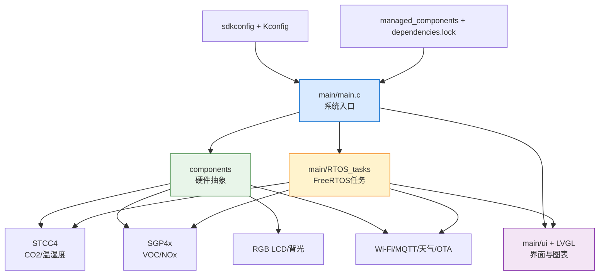
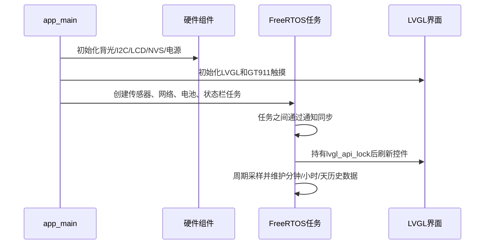

# IoT Environment Monitor 项目学习指南

## 项目定位

这是一个运行在 ESP32-S3 上的室内环境监测终端。系统通过 I2C 读取 CO2、温湿度和空气质量传感器，通过 ADC 读取电池电压，通过 RGB LCD + LVGL 显示数据，并提供 Wi-Fi、NTP、天气、MQTT、OTA 和低功耗功能。

项目没有记录每个文件的真实作者信息，因此不能凭文件名推断“谁编写”。可以按工程归属理解：`main/` 是应用层代码，`components/` 是本项目自研或集成的可复用组件，`managed_components/` 是 ESP Component Registry 下载的第三方组件，`main/ui/generated/` 通常由 SquareLine/LVGL 图形工具生成。

## 总体关系



## 启动流程



## 目录和文件职责

| 路径 | 作用 | 编写方式 |
|---|---|---|
| `CMakeLists.txt` | ESP-IDF 顶层构建入口 | 手写 CMake，调用 `project.cmake` |
| `sdkconfig*` | 芯片、驱动和功能配置 | `menuconfig` 生成或维护 |
| `partitions.csv` | Flash 分区布局 | 手写 CSV |
| `main/main.c` | 系统启动、总线初始化、任务创建 | 手写 C |
| `main/RTOS_tasks/*.c` | 一个文件一个 FreeRTOS 任务 | 手写 C |
| `main/lvgl_setup.c` | LVGL 显示和触摸初始化 | 手写 C |
| `main/ui/generated/*` | 屏幕、控件、字体和事件代码 | 通常由 GUI 工具生成 |
| `main/ui/custom/*` | 对生成 UI 的人工扩展 | 手写 C |
| `main/ui/data_chart.c` | 历史数据缓存和图表刷新 | 手写 C |
| `components/backlight` | PWM 背光驱动 | ESP-IDF LEDC |
| `components/rgb_lcd` | RGB LCD 总线和面板驱动 | ESP-IDF LCD API |
| `components/stcc4` | STCC4 CO2/温湿度驱动 | I2C |
| `components/sgp4x` | SGP40/SGP4x 空气质量驱动 | I2C + Sensirion 算法 |
| `components/bat_adc` | 电池 ADC 采样 | ADC 校准 API |
| `components/wifi` | Wi-Fi 初始化、连接和状态 | ESP-IDF event loop |
| `components/mqtt_user` | MQTT 参数和发布逻辑 | ESP-MQTT |
| `components/weather` | HTTP 天气数据解析 | 网络请求 |
| `components/ota` | OTA 升级 | `esp_https_ota` |
| `components/nvs_helper` | 设置参数持久化 | NVS |
| `components/power_management` | 电源芯片和充电控制 | I2C/GPIO |
| `components/lpm` | 低功耗策略 | ESP-IDF 电源管理 |
| `managed_components` | 外部依赖，如 LVGL、GT911 | `idf.py` 组件管理器下载 |

## 任务协作

`get_data_task` 每 $5$ 秒通知 `stcc4_task` 和 `sgp4x_task` 采样，然后把最新结果放入图表缓存。`stcc4_task` 更新全局结构体，`sgp4x_task` 更新 `voc_index`。天气任务只在 Wi-Fi 在线时请求数据，并在更新 LVGL 控件前获取 `lvgl_api_lock`，避免并发访问 LVGL。

## 学习顺序

建议先读 `main/main.c`，再读 `RTOS_tasks.h` 和 `get_data_task.c`，然后分别跟进 `stcc4.c`、`sgp4x.c`、`data_chart.c`。理解硬件驱动后再读 `wifi.c`、`mqtt_user.c`、`weather.c` 和 `ota.c`。最后阅读 `ui/generated`，掌握生成代码与人工扩展的边界。

## 构建和验证

```powershell
idf.py set-target esp32s3
idf.py reconfigure
idf.py build
idf.py flash monitor
```

生成物位于 `build/`。`managed_components` 不应手工修改；修改依赖应更新 `dependencies.lock`。如果 CMake 提示某个 SDK 目录缺少 `CMakeLists.txt`，先检查 `IDF_PATH`、`IDF_TOOLS_PATH` 和 VS Code 的 ESP-IDF 版本是否一致。
