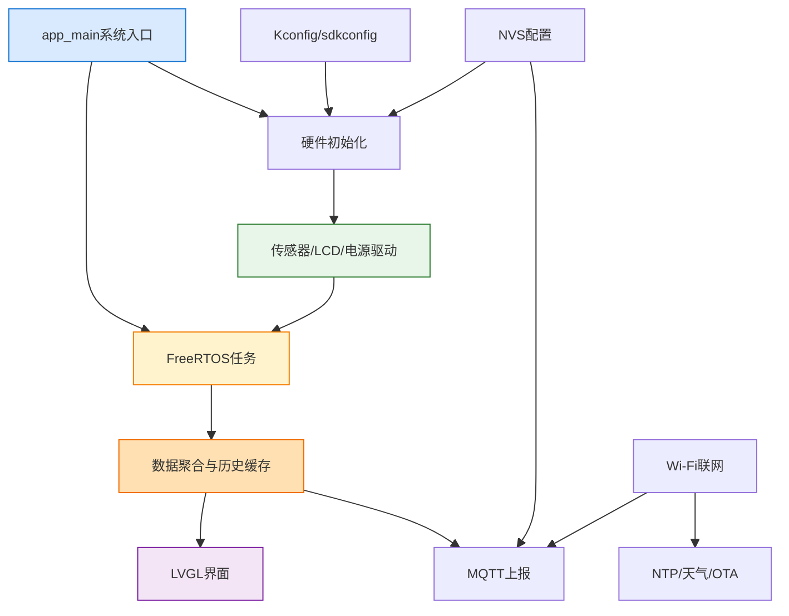
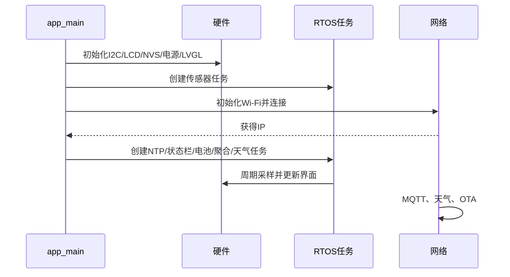
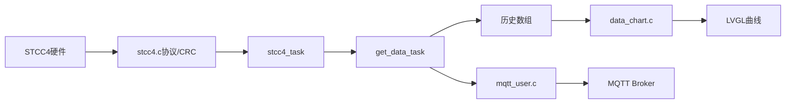

# ESP32-S3 IoT 环境监测仪学习手册

> 本手册面向初学者，按“整体架构 → 文件职责 → 数据流 → 编写与移植 → 调试”的顺序学习。

## 项目整体架构

本项目把传感器、显示、触摸、网络和 OTA 组织成分层系统：硬件产生信号，组件驱动负责协议，FreeRTOS 任务负责调度，数据任务负责聚合，LVGL 和 MQTT 分别负责本地显示和云端上报。



可以把它理解为工厂：驱动是工人，任务是生产线，数据聚合是仓库，UI 和 MQTT 是两个出货窗口，`app_main()` 是总调度员。

## 目录和文件作用

| 文件/目录 | 作用 | 编写方式 |
|---|---|---|
| `CMakeLists.txt` | ESP-IDF 构建入口 | 手写 CMake |
| `main/main.c` | 初始化硬件、创建任务 | 手写应用代码 |
| `main/RTOS_tasks/*.c` | 采样、聚合、电池、天气、状态栏任务 | 手写 FreeRTOS |
| `main/lvgl_setup.c` | LVGL、LCD、触摸适配 | 手写硬件适配 |
| `main/ui/custom/*` | 页面业务和事件 | 手写 UI 业务 |
| `main/ui/generated/*` | 页面、控件、字体、图片 | GUI 工具生成 |
| `main/ui/data_chart.*` | 历史数组和图表 | 手写业务模块 |
| `components/*` | 可复用驱动和服务 | 头文件 API + C 实现 |
| `sdkconfig*`、`Kconfig.projbuild` | 芯片、引脚、功能配置 | menuconfig 生成/维护 |
| `partitions.csv` | Flash 分区 | 手写布局 |

组件标准结构是 `CMakeLists.txt`、`include/name.h`、`name.c`。头文件公开 API，C 文件隐藏协议细节；调用方只包含头文件。

## 从 `main.c` 开始

### `i2c_master_init()`

读取 `CONFIG_I2C_MASTER_SDA`、`CONFIG_I2C_MASTER_SCL`，填写 `i2c_master_bus_config_t`，调用 `i2c_new_master_bus()` 创建共享 I2C 总线。它只创建总线，STCC4、SGP4x、GT911 等组件再按地址创建设备句柄。

### `app_main()` 顺序

关闭背光 → 创建 I2C → 初始化 RGB LCD → 初始化 NVS 和低功耗 → 初始化电源管理 → 创建 LVGL 和 GT911 → 创建 STCC4/SGP4x 任务 → 初始化 Wi-Fi 和事件回调 → 自动连接保存的 AP → 创建 NTP、状态栏、电池、聚合和天气任务。

顺序不能任意交换：任务依赖驱动，网络服务依赖 IP，UI 更新依赖 LVGL 初始化。



## `main` 各文件

### `RTOS_tasks/RTOS_tasks.h`

公共任务接口，声明 `stcc4_task()`、`sgp4x_task()`、`get_data_task()`、`bat_adc_task()`、`weather_task()` 和任务句柄。其他模块通过它创建任务或发送通知。

### `stcc4_task.c`

负责“什么时候读 STCC4”。任务等待 `ulTaskNotifyTake()`，收到通知后调用驱动测量 API，成功则更新 CO2、温度和湿度结果，再次阻塞。I2C 命令和 CRC 应留在 `components/stcc4/stcc4.c`。

### `sgp4x_task.c`

读取 `sraw_voc`，用温湿度补偿后调用 `GasIndexAlgorithm_process()` 得到 `voc_index`。算法状态不能每轮重新初始化，否则 VOC 基线无法建立。

### `get_data_task.c`

数据聚合中心：通知传感器、读取结果、更新分钟/小时/日历史数组、准备 MQTT 数据并更新图表。阅读时重点找共享结构的读写和锁。

### `bat_adc_task.c`

调用 ADC 组件计算电池电压和百分比，并根据充电阈值控制 AW32001。充电应有迟滞，避免阈值附近反复开关。

### `status_bar_task.c`

周期刷新时间、Wi-Fi、MQTT、电量和充电图标；它只转换状态，不负责 Wi-Fi 连接。

### `weather_task.c`

独立执行 HTTP 请求和 JSON 解析。网络请求可能阻塞，不能放进 LVGL 任务；完成后短暂加锁更新控件。

### `lvgl_setup.c`

创建 LCD panel、绘图缓冲、flush/VSYNC 回调、GT911 输入设备和 LVGL 后台任务，是 LVGL 与硬件之间的适配层。

### `ui/data_chart.c`、`ui/status_bar.c`

前者维护历史数据和图表，后者把时间、网络、电量状态写入顶部状态栏。任务决定何时更新，UI 文件决定更新哪个控件。

### `ui/custom/` 与 `ui/generated/`

`custom` 放手写事件、按钮和设置逻辑；`generated` 中 `gui_guider.c` 创建页面，`setup_scr_*.c` 创建具体屏幕，`events_init.c` 绑定事件，字体和图片是资源。不要直接改生成文件。

## 组件和关键接口

| 组件 | 责任 | 使用顺序 |
|---|---|---|
| `stcc4` | I2C 命令、延时、CRC、单位换算 | init → single shot → read |
| `sgp4x` | 原始 VOC/NOx 信号 | init → measure_signals |
| `backlight` | LEDC PWM | init → set duty |
| `rgb_lcd` | RGB 时序和面板 | init → flush |
| `bat_adc` | ADC 校准和电量 | init → read |
| `power_management` | AW32001 电源充电 | init → read/set |
| `wifi` | STA 初始化和连接 | init → connect |
| `mqtt_user` | Broker 连接和发布 | connect → publish |
| `weather` | HTTP 和 JSON | request → parse |
| `nvs_helper` | 参数持久化 | init → read/write |
| `ota` | HTTPS 下载和分区切换 | check → download → verify |
| `lpm` | 低功耗 | init → configure |

## 传感器驱动怎样编写

一个可移植驱动分四层：

```text
name.h：类型、地址、init/read/deinit
总线适配：I2C read/write、超时、错误码
芯片协议：命令字、等待时间、CRC、原始字节
数据换算：转换为项目统一单位
```

驱动不能直接调用 LVGL、MQTT 或页面对象。新增传感器时创建组件目录，在 CMake 声明依赖，实现 API，创建采集任务，把字段接入历史、UI 和 MQTT，并处理设备缺失和超时。

## 一条 CO2 数据的完整链路



阅读代码时搜索 `stcc4` 结果结构：找到驱动写入位置，再找任务读取位置，继续追踪聚合数组、图表 API 和 MQTT JSON 字段。VOC、电池、天气也用同样方法分析。

## FreeRTOS 和 LVGL 初学者重点

`xTaskCreateWithCaps()` 创建独立任务，任务不能依赖已经失效的局部变量。`xTaskNotifyGive()` 适合一对一唤醒，`ulTaskNotifyTake(pdTRUE, timeout)` 阻塞等待；多消费者改用队列或事件组。周期采样优先使用 `vTaskDelayUntil()`。

LVGL 非线程安全。后台调用 `lv_label_set_text`、`lv_chart_set_next_value`、`lv_obj_add_flag` 前必须获取项目 LVGL 锁；锁内不能执行 HTTP、长时间 I2C 或大量日志。

## 配置、移植和构建

修改板卡先执行 `idf.py set-target esp32s3`，检查 `sdkconfig.defaults.esp32s3`、`main/Kconfig.projbuild`、`partitions.csv`。引脚、分辨率和 PSRAM 放 Kconfig，协议和业务放 C 文件。移植 LCD 时替换 `rgb_lcd` 的面板、时序和 DMA 参数，保持 LVGL flush 接口不变。移植传感器时保持 `init/read/deinit` 接口。

```powershell
idf.py set-target esp32s3
idf.py reconfigure
idf.py build
idf.py -p COMx flash monitor
```

`build/` 是生成目录，不能手工修改。出现 C3/RISC-V 缓存错误时移走旧构建目录后重新配置。当前 ESP32-S3 构建已验证成功；GT911 旧坐标 API 是弃用警告，不是构建失败。

## 新增 CO2 超限告警的文件关系

```text
stcc4.c 提供数值
  ↓
get_data_task.c 比较阈值
  ↓
custom.c 修改标签和颜色
  ↓
status_bar.c 显示图标
  ↓
mqtt_user.c 增加 alarm 字段
  ↓
nvs_helper.c 保存阈值
```

不要在 `stcc4.c` 中直接操作 UI，因为驱动层不应该知道页面对象。

## 调试表

| 现象 | 排查重点 |
|---|---|
| 找不到 I2C | 电源、共地、SDA/SCL、上拉、地址、探测日志 |
| LCD 花屏 | RGB 时序、DMA、PSRAM、VSYNC |
| UI 崩溃 | LVGL 锁、对象生命周期、回调线程 |
| VOC 异常 | 预热、补偿、算法状态是否重置 |
| Wi-Fi 重连 | 2.4 GHz、NVS 凭据、事件回调、DHCP |
| OTA 失败 | URL/证书、分区空间、镜像校验、回滚 |

## 作者、历史与学习顺序

文件名不能证明个人作者。用 `git log --follow -- path/to/file` 和 `git blame path/to/file` 查看真实提交作者。通常应用代码和组件是手写的，`ui/generated` 是工具生成的，第三方算法来自外部库。

推荐顺序：先读 `main.c`，画启动顺序；再读 `RTOS_tasks.h` 和 `get_data_task.c`；完整追踪 CO2 一条数据；然后学习 LVGL 锁、Wi-Fi、MQTT、NVS、OTA。练习包括调整采样周期、增加 CO2 告警、给历史数组加锁、把通知改为队列、增加 MQTT `uptime`、实现 NVS 配置迁移和迁移 GT911 新 API。
